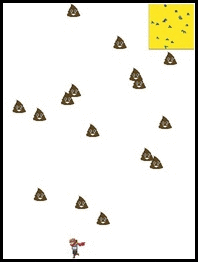
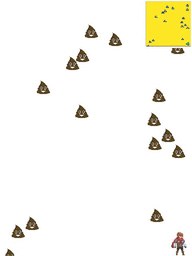
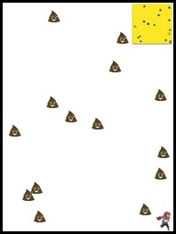

# Reinforcement Learning 

This repository includes python codes of reinforcement learning (RL) models. RL can be used in robotics, traffic light control, stock trading etc.  
A simple video game is developed with PyGame instead of using known libraries for RL (e.g., OpenAI Gym).
 
**Demo**\
The following videos demonstrate how a trained RL model plays the game.

  \
I set the surface slippery to make it hard to control the character.
The map on top-right of each screen is the input of the RL model.
You can also play the simple game (see below). 


**Dependancies**
* Python v3.7
* Tensorflow v1.15
* NumPy
* OpenCV
* PyGame


**If you want to play the game by yourself**
```
run.py --phase='manual_play'
```

**To train a RL model (currently Deep-Q is only included)**
```
run.py --phase='train'
```

**Let the trained RL model play the game**
```
run.py --phase='test'
``` 