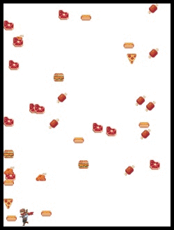
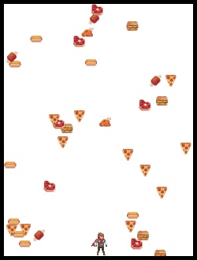
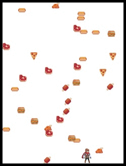
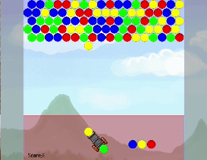

# Reinforcement Learning 

This repository includes python codes of reinforcement learning (RL) models (for now only Deep-Q).
RL can be used in robotics, traffic light control, stock trading etc.  
 
**Demo of trained models**
* Adventurer (vegetarian version)

  \
The adventurer is a vegetarian, he needs to evade meats. 
 I set the surface slippery to make it hard to control. 
 Use ```Left``` and ```right``` to move. 

* Bubble Shooter (not trained yet, coming soon)\
\
Shoot the bubbles and match the color to pop.
 Game over if a bubble hits the ground.
 ```Left``` and ```right``` to aim, ```space bar``` to shoot. 


**Game Assets**
* Adventurer
  - Adventurer images: https://rvros.itch.io/animated-pixel-hero
  - Meat images: https://vectorpixelstar.itch.io/food?download
 * Bubble Shooter
   - Base code: https://github.com/PranavB6/Bubbles_2.0

**Dependancies**
* Python v3.7
* Tensorflow v1.15
* NumPy
* OpenCV
* PyGame

**To play a game by yourself**
```
run.py --game='vegetarian' --phase='manual_play'
```

**To train a RL model (for now, Deep-Q is only included)**
```
run.py --game='vegetarian' --phase='train'
```

**Let the trained RL model play the game**
```
run.py --game='vegetarian' --phase='test'
``` 